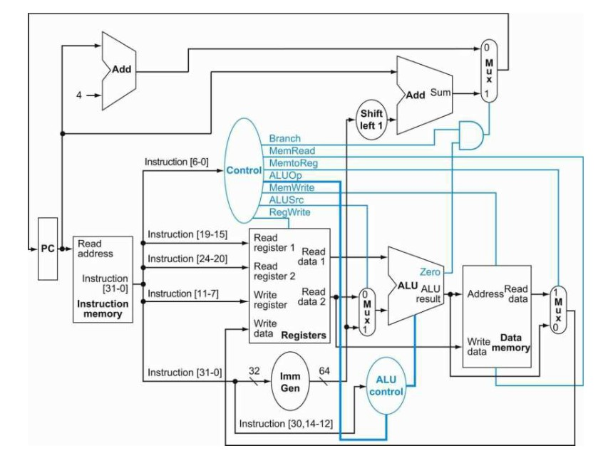

# CPU Datapath



## Datapath Components:

- Program Counter (PC)
- Instruction Memory (Imem)
- ALU (Arithmetic Logic Unit)
- Control Unit
- Register File
- Data Memory (Dmem)
- Multiplexers (Mux)
- Decoder
- Immediate Generator (Imm Gen)

## Getting Started with the Program Counter

The program counter is the register containing the address of the current instruction in the program being executed.
We need to implement it so the CPU is able to keep track of the addresses where we are supposed to be executing code.

Why add four to the PC?

In RISC-V, instructions are four bytes long. In order to advance to the next instruction when executing a program, we need to advance
the PC by four bytes to point to the next instruction in memory.

To get started implementing the PC, we need to set up a few things:

- Instruction Memory (this is where the actual instructions are stored and fetched from)

- PC Register (holds the current instruction address)

- Adder (required to increment the PC)

- Mux (we'll need a mux to decide whether the PC should increment normally (PC + 4) or branch/jump to another address)

- Control Logic (actual logic that handles the branch or jump conditions)

At a high level, we can break down the implementation into the following steps. For now, I have only written the logic for sequential 
instructions to work, and I am focusing on the key steps to achieve a working program counter.

## 1. PC Register

Initialize the module for `pc_register`. It holds the current value of the PC and resets to `0` if `reset` is high.
On each clock cycle, it updates to the new PC value (`pc_in`), which will be provided by the adder (PC + 4).

```verilog
module pc_register(
    input clk,              // Clock input
    input reset,            // Reset input
    input [31:0] pc_in,     // Input for the next PC value
    output reg [31:0] pc_out // Output of the current PC value
);
    always @(posedge clk or posedge reset) begin
        if (reset)
            pc_out <= 32'b0;   // Initialize PC to 0 on reset
        else
            pc_out <= pc_in;    // Update PC with next address
    end
endmodule
```
 
## 2. Adder

Accept a 32-bit input for the current `pc` value and output the next 32-bit value of the PC (`pc_next`). To increment the PC, we can
use the familiar approach `assign pc_next = pc + 4`. Our basic `adder` module simply adds 4 to the current `pc` value to generate
`pc_next`, which will be passed back to the PC register on the next cycle.

```verilog
module adder(
    input [31:0] pc,        // Current PC value input
    output [31:0] pc_next   // Output of next PC value (PC + 4)
);
    assign pc_next = pc + 4;    // Increment the PC by 4
endmodule
```

## 3. Instruction Memory
The instruction memory is just the memory region used to store the program's instructions. This is where instructions are fetched from
and will be sent to the PC. I'll use a 32-bit array `addr` as input to support the addresses of each instruction from the PC.
The instruction memory module will output `instruction`, which is the fetched instruction corresponding to the current PC.

```verilog
module instruction_memory(
    input [31:0] addr,          // Address input (PC value)
    output [31:0] instruction   // Output fetched instruction
);
    reg [31:0] memory [0:255];  // Memory array to store 256 instructions

    initial begin
        // Load some instructions (RISC-V machine code in hex)
        memory[0] = 32'h00a00093; // addi x1, x0, 10
        memory[1] = 32'h00b00113;  // addi x2, x0, 11
        memory[2] = 32'h00c00193;  // addi x3, x0, 12
    end

    assign instruction = memory[addr[9:2]]; // Fetch instruction (use addr[9:2] as index)
endmodule
```

## 4. Integration

To test the functionality of our PC register, adder, and instruction memory, we can integrate each component into a top-level module.
This `top` module will fetch instructions, increment the PC, and continue the loop. Tying everying together, we instantiate the PC to 
update on each clock cycle, the adder increments the PC by 4, and the instruction memory fetches the instruction based on the current PC.

```verilog
module top(
    input clk,                // Clock input
    input reset               // Reset input
);
    wire [31:0] pc_out;       // Current PC value (output from pc_register)
    wire [31:0] pc_next;      // Next PC value (output from adder)
    wire [31:0] instruction;  // Current instruction (output from instruction_memory)

    // Instantiate PC register
    pc_register PC(
        .clk(clk),
        .reset(reset),
        .pc_in(pc_next),       // Next PC value comes from the adder
        .pc_out(pc_out)        // Current PC value is outputted to be used
    );

    // Instantiate Adder (adds 4 to the current PC)
    adder ADD(
        .pc(pc_out),           // Current PC value
        .pc_next(pc_next)      // Output of next PC value (PC + 4)
    );

    // Instantiate Instruction Memory (fetches instruction based on PC)
    instruction_memory IMEM(
        .addr(pc_out),         // Use current PC value as the address
        .instruction(instruction) // Output instruction fetched from memory
    );

    // Output
    always @(posedge clk) begin
        $display("PC = %h, Instruction = %h", pc_out, instruction); // Display PC and instruction
    end
endmodule
```

## Full Program Counter (Supports Sequential Instructions Only)

```verilog
// PC Register Module
module pc_register(
    input clk,              // Clock input
    input reset,            // Reset input
    input [31:0] pc_in,     // Input for the next PC value
    output reg [31:0] pc_out // Output of the current PC value
);
    always @(posedge clk or posedge reset) begin
        if (reset)
            pc_out <= 32'b0;   // Initialize PC to 0 on reset
        else
            pc_out <= pc_in;    // Update PC with next address on the clock edge
    end
endmodule

// Adder Module
module adder(
    input [31:0] pc,        // Current PC value input
    output [31:0] pc_next   // Output of next PC value (PC + 4)
);
    assign pc_next = pc + 4;    // Increment the PC by 4
endmodule

// Instruction Memory Module
module instruction_memory(
    input [31:0] addr,          // Address input (PC value)
    output [31:0] instruction   // Output fetched instruction
);
    reg [31:0] memory [0:255];  // Memory array to store 256 instructions

    initial begin
        // Load some instructions (RISC-V machine code in hex)
        memory[0] = 32'h00a00093; // addi x1, x0, 10
        memory[1] = 32'h00b00113;  // addi x2, x0, 11
        memory[2] = 32'h00c00193;  // addi x3, x0, 12
    end

    assign instruction = memory[addr[9:2]]; // Fetch instruction (use addr[9:2] as index)
endmodule

// Top Module to connect everything together
module top(
    input clk,                // Clock input
    input reset               // Reset input
);
    wire [31:0] pc_out;       // Current PC value (output from pc_register)
    wire [31:0] pc_next;      // Next PC value (output from adder)
    wire [31:0] instruction;  // Current instruction (output from instruction_memory)

    // Instantiate PC register
    pc_register PC(
        .clk(clk),
        .reset(reset),
        .pc_in(pc_next),       // Next PC value comes from the adder
        .pc_out(pc_out)        // Current PC value is outputted to be used
    );

    // Instantiate Adder (adds 4 to the current PC)
    adder ADD(
        .pc(pc_out),           // Current PC value
        .pc_next(pc_next)      // Output of next PC value (PC + 4)
    );

    // Instantiate Instruction Memory (fetches instruction based on PC)
    instruction_memory IMEM(
        .addr(pc_out),         // Use current PC value as the address
        .instruction(instruction) // Output instruction fetched from memory
    );

    // Output
    always @(posedge clk) begin
        $display("PC = %h, Instruction = %h", pc_out, instruction); // Display PC and instruction
    end
endmodule
```

## Final Notes
I did my best to follow the material from the textbook and model my work on the datapath diagrams and explanations from chapter 4.
I'm open to feedback on any mistakes. If this looks okay, I think I can build upon the starting modules here and work on the other 
pieces like the decoder, ALU, supporting branch/jump instructions, etc.
