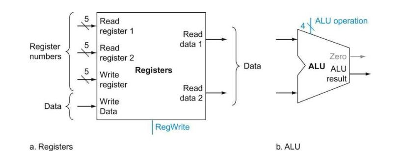

# Role of the Register File and Arithmetic Logic Unit

The Register File and Arithmetic Logic Unit (ALU) are core components in the RISC-V CPU that play crucial roles in executing instructions.



## Register File
The Register File holds a set of 32 registers used for quick data access during execution. It:
- Stores operands needed by the ALU for computations.
- Retains intermediate values and results of calculations.
- Contains the general-purpose registers `x0` to `x31` for holding temporary data.

## Arithmetic Logic Unit (ALU)
The ALU is responsible for arithmetic and logical operations needed to execute instructions. It:
- Executes operations like addition, subtraction, bitwise operations, and comparisons.
- Interacts with the Register File, receiving operands and outputting results.
- Is (supposed to be) optimized for efficiency to maintain high throughput in a pipelined architecture.

# Register File Implementation

Below are the key components of the register file. I've done my best to explain the implementation for clarity.

## 1. Register Array

The registers array is a set of 32 registers (32 bits each) that stores data for fast access.
```verilog
// Register array for 32 registers
reg [31:0] registers [0:31];
```

## 2. Read Operations

The read operations retrieve data from the registers based on the addresses `read_reg1` and `read_reg2`. If the address is zero, it outputs zero since `x0` is hardwired to zero in RISC-V.

```verilog
// Write operation
always @(posedge clk or posedge reset) begin
    if (reset) begin
        integer i;
        for (i = 0; i < 32; i = i + 1) begin
            registers[i] <= 32'b0;
        end
    end else if (reg_write && write_reg != 0) begin
        registers[write_reg] <= write_data;
    end
end
```

## 3. Write Operation

The write operation updates the register at `write_reg` on the rising edge of `clk`, only if `reg_write` is enabled and `write_reg` is non-zero.

```verilog
// Write operation
always @(posedge clk or posedge reset) begin
    if (reset) begin
        integer i;
        for (i = 0; i < 32; i = i + 1) begin
            registers[i] <= 32'b0;
        end
    end else if (reg_write && write_reg != 0) begin
        registers[write_reg] <= write_data;
    end
end
```

## Full Register File Module

```verilog
module register_file(
    input clk,                  // Clock input
    input reset,                // Reset input
    input [4:0] read_reg1,      // Register address for first read
    input [4:0] read_reg2,      // Register address for second read
    input [4:0] write_reg,      // Register address for write
    input [31:0] write_data,    // Data to be written to register
    input reg_write,            // Write enable signal
    output [31:0] read_data1,   // Data output of first read
    output [31:0] read_data2    // Data output of second read
);

    // Register array for 32 registers
    reg [31:0] registers [0:31];

    // Read operations
    assign read_data1 = (read_reg1 != 0) ? registers[read_reg1] : 32'b0;
    assign read_data2 = (read_reg2 != 0) ? registers[read_reg2] : 32'b0;

    // Write operation
    always @(posedge clk or posedge reset) begin
        if (reset) begin
            integer i;
            for (i = 0; i < 32; i = i + 1) begin
                registers[i] <= 32'b0;
            end
        end else if (reg_write && write_reg != 0) begin
            registers[write_reg] <= write_data;
        end
    end
endmodule
```
